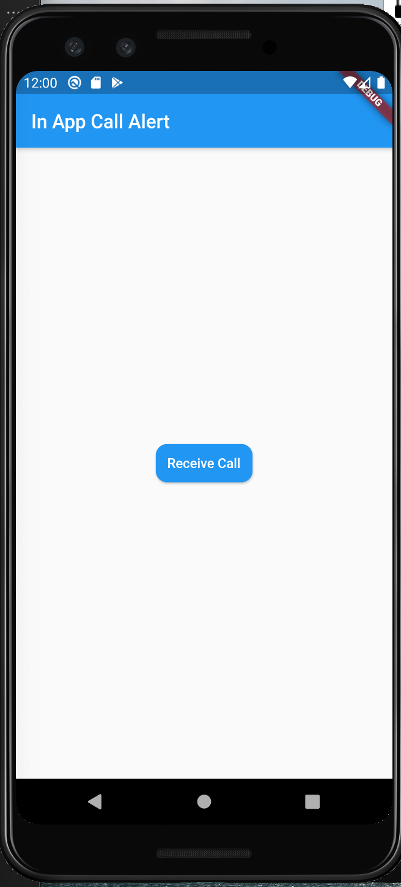
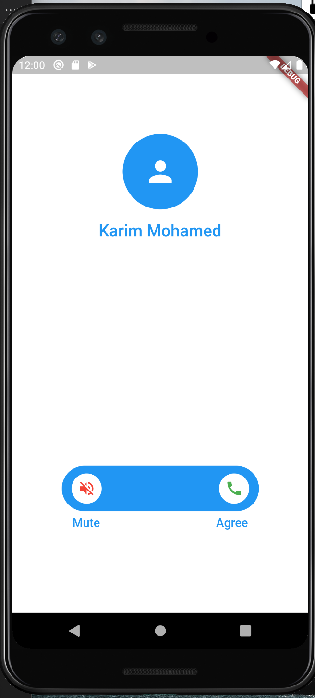

# in_app_call_alert

A new Flutter package to show an alert screen.

### Currently Supported by awesome [DPLYR](https://dplyr.dev)

* [DPLYR](https://dplyr.dev) is a new generation of cloud platforms and aims to help developers in their road with open source contributions, and at the end we can say thanks.

## Screenshots




## Usage

[Example](https://github.com/KarimMohamed20/InAppCallAlert/blob/master/example/lib/main.dart)

To use this package :

* add the dependency to your **pubspec.yaml**

``` yaml
  dependencies:
    flutter:
      sdk: flutter
    in_app_call_alert:
```

### How to use

``` dart
CallAlert(
    callerName: 'Karim Mohamed',
    ringtonePath: 'ringtone.mp3',
    onAgree: (){
      Navigator.pop(context);
      print('Working!');
  },
)
```

## ِExample

``` dart
class MyHomePage extends StatefulWidget {
  @override
  _MyHomePageState createState() => _MyHomePageState();
}

class _MyHomePageState extends State<MyHomePage> {
  @override
  Widget build(BuildContext context) {
    return Scaffold(
      appBar: AppBar(
        title: Text('In App Call Alert'),
      ),
      body: Container(
        width: MediaQuery.of(context).size.width,
        height: MediaQuery.of(context).size.height,
        child: Column(
          mainAxisAlignment: MainAxisAlignment.center,
          crossAxisAlignment: CrossAxisAlignment.center,
          children: [

            RaisedButton(
              onPressed: () {
                Navigator.push(context, MaterialPageRoute(
                  builder: (context)=> CallAlert(callerName: 'Karim Mohamed',
                  ringtonePath: 'ringtone.mp3',
                  onAgree: (){
                    Navigator.pop(context);
                    print('Working!');
                  },
                  )
                ));
              },
              child: Text(
                "Receive Call",
                style: TextStyle(color: Colors.white),
              ),
              padding: EdgeInsets.all(12),
              color: Colors.blue,
              shape: RoundedRectangleBorder(
                  borderRadius: BorderRadius.circular(12)),
            )
          ],
        ),
      ),
    );
  }
}
```

### All Supported Projects by [DPLYR](https://dplyr.dev)
* [Splash Screen - Flutter](https://github.com/DPLYR-dev/SplashScreenFlutterPackage)
  <br> a flutter package created to show simple splashscreen

* [In App Call Alert - Flutter](https://github.com/DPLYR-dev/InAppCallAlert)
  <br> a flutter package created recently to show call alert with sound

* [File Manager](https://github.com/DPLYR-dev/file-manager)
  <br> a php project created to manage machines/servers through ftp servers


### Created by [Karim Mohamed](https://github.com/KarimMohamed20)
